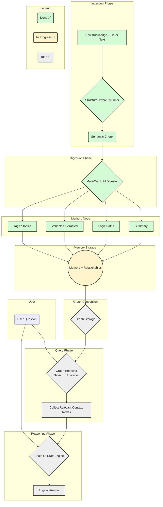

[](LICENSE) 
[](https://badge.fury.io/py/llm-lucid-memory)
[](https://github.com/benschneider/llm-lucid-memory/milestone/1)
[]()


---

## 📚 Table of Contents
- [Why Lucid Memory?](#-why-lucid-memory)
- [Vision: The Reasoning Graph](#-vision-the-reasoning-graph)
- [Core Concept: Graph-Based Reasoning](#-core-concept-graph-based-reasoning)
- [Key Features (v0.3 Focus)](#-key-features-v03-focus)
- [Unified API Server](#-unified-api-server)
- [Quickstart](#-quickstart)
- [How to Use with Local LLMs](#-how-to-use-with-local-llms-ollama-lmstudio-etc)
- [Example API Usage (Conceptual)](#-example-api-usage-conceptual)
- [Roadmap Highlights (Post v0.3)](#-roadmap-highlights-post-v03)
- [Project Structure](#-project-structure)
- [Contributing](#-contributing)
- [License and Commercial Use](#-license-and-commercial-use)
---

# 🧠 llm-lucid-memory (Approaching v0.3)

**Lucid Memory** is an open-source project evolving towards a **reasoning graph** for LLMs. It enables LLMs to comprehend and reason about large codebases and document sets by breaking them into understandable chunks, pre-processing the logic within each chunk, and connecting them structurally. All functionalities are exposed via a unified API server.

> **Imagine:** Your LLM navigating a graph of interconnected concepts and code logic, not just processing isolated text snippets, all managed through a robust API.

---

## 🌟 Why Lucid Memory?

- **Go Beyond Context Limits:** Overcome the input size limitations of LLMs.
- **Deep Understanding:** Move past simple RAG retrieval towards comprehending structure and logic.
- **Structured Knowledge:** Represent information as an interconnected graph, not just isolated vector chunks.
- **Code Comprehension:** Specifically designed to pre-process and understand the logic within code functions/classes.
- **Efficient Retrieval:** Graph traversal allows targeted retrieval of necessary linked context (future focus).
- **API First:** Core functionalities are accessible via a unified FastAPI server, allowing integration with various applications and workflows.
- **Modular & Extensible:** Core components (chunker, digestor, graph, retriever) are designed for flexibility.

---

## ✨ Vision: The Reasoning Graph

We are building a system that allows LLMs (and applications using LLMs) to:
    - **Chunk** large documents and codebases into meaningful, context-aware units (sections, functions, classes) via API calls.
    - **Digest** each chunk to extract not just summaries, but **pre-processed understanding** (like logical steps in code) using LLMs, managed via the API.
    - **Connect** these digested chunks (Memory Nodes) into a **graph** representing structural and potentially logical relationships.
    - **Retrieve** knowledge not just by keywords or semantic similarity, but by **traversing the graph** to gather relevant, linked context (foundational retrieval in place, advanced traversal is future work).
    - **Reason** over this structured, interconnected knowledge graph, enabling deeper comprehension and more accurate outputs, even with limited context windows, facilitated by an LLM proxy API.

Helping LLMs think big by building structured, navigable "mental models" of information, accessible programmatically. 🚀

---

## 🧩 Core Concept: Graph-Based Reasoning

(This section can remain largely the same, as the core concept hasn't changed, just its accessibility)

**The Problem:**
- LLMs struggle with large, complex inputs (codebases, documentation).
- Simple RAG often retrieves irrelevant or incomplete context due to lack of structural awareness.
- LLMs need systems that mirror structured thinking and knowledge linking.

**The Lucid Memory Solution (v0.3 Architecture):**
1.  **Structure-Aware Chunking (API-driven):** Use the `/library/chunk` API endpoint to break down input based on its type (Markdown headers, code functions/classes via Abstract Syntax Trees).
2.  **Multi-faceted Digestion (API-driven):** Use the `/library/process` API endpoint to process chunks. For each chunk, the `Digestor` uses targeted LLM calls to extract:
    *   Concise Summary
    *   Key Concepts / Logical Steps (Chain-of-Thought for code)
    *   Key Variables / Parameters / Entities (for code)
    *   Relevant Tags
3.  **Memory Node Creation:** Store digested chunk information in a `MemoryNode`. (Optionally, embeddings can be generated via `Embedder`).
4.  **Graph Construction & Persistence:** `MemoryNode`s are added to the `MemoryGraph`, which is persisted to `memory_graph.json`.
5.  **Contextual Augmentation (Proxy API):** The `/v1/chat/completions` endpoint acts as an LLM proxy. It:
    *   Uses the `Retriever` to find relevant nodes via keyword search (semantic search planned).
    *   (Future: Traverses the graph to gather connected, contextual information).
    *   Injects this context into the prompt for a backend LLM.
6.  **Informed Generation:** The backend LLM uses the provided graph context for more informed reasoning and answer generation.

---
## 🔑 Key Features (v0.3 Focus)

*   **Unified FastAPI Server (`server_api.py`):**
    *   **Library Control API (`/library/*`):** Endpoints for chunking, processing, node management, and configuration.
    *   **LLM Proxy API (`/v1/chat/completions`):** Ollama-compatible endpoint for context-augmented chat.
*   **Structure-Aware Chunking:** For Python, Markdown, and plain text.
*   **LLM-Powered Digestion:** Extracts summaries, key concepts, tags, and code-specifics (dependencies, outputs, key variables).
*   **Memory Graph:** Stores processed `MemoryNode`s with persistence to JSON.
*   **Basic Retrieval:** Keyword-based retrieval of memory nodes.
*   **Configurable Backend:** Supports various OpenAI-compatible LLM backends (Ollama, LM Studio, etc.) for digestion and proxying.

---

## 🚀 Quickstart

1.  **Installation:**
    ```bash
    pip install llm-lucid-memory
    # Or for development:
    # git clone https://github.com/benschneider/llm-lucid-memory.git
    # cd llm-lucid-memory
    # pip install -e .
    ```

2.  **Configuration:**
    *   Ensure you have an LLM running that's compatible with the OpenAI API format (e.g., Ollama with a model like `qwen2` or `mistral`).
    *   Copy `lucid_memory/proxy_config.example.json` to `lucid_memory/proxy_config.json` (if installing from source) or create `lucid_memory/proxy_config.json` in your installed package's `lucid_memory` directory (usually in your Python environment's `site-packages`).
    *   Edit `lucid_memory/proxy_config.json`:
        ```json
        {
          "api_type": "Ollama", // Or "LM Studio", "OpenAI", etc.
          "backend_url": "http://localhost:11434/v1/chat/completions", // Your LLM's chat completions endpoint
          "model_name": "your-llm-model-name", // e.g., "mistral", "qwen2.5-7b-instruct"
          "embedding_api_model_name": "nomic-embed-text", // For optional embeddings
          "api_key": "", // If your backend LLM requires an API key

          "unified_server_host": "127.0.0.1",
          "unified_server_port": 8081,
          // Other paths are usually auto-detected relative to the package
        }
        ```
    *   (Optional) Edit `lucid_memory/prompts.yaml` to customize LLM instructions.

3.  **Run the Unified Server:**
    ```bash
    lucid-memory-server
    ```
    This will start the FastAPI server, typically on `http://127.0.0.1:8081`. Check the console output for the exact address.

4.  **Interact with the API:**
    *   Use tools like `curl`, Postman, or Python's `requests` library.
    *   **Chunk content:** `POST http://127.0.0.1:8081/library/chunk` with JSON `{"source_code": "def hello():\n  print('world')", "identifier": "my_script.py"}`
    *   **Process chunks:** `POST http://127.0.0.1:8081/library/process` with JSON `{"chunks": [...], "original_filename": "my_script.py"}`
    *   **Chat with context:** Configure your LLM client application to use `http://127.0.0.1:8081/v1/chat/completions` as its OpenAI-compatible endpoint.

---

## 🌐 Unified API Server

Lucid Memory v0.3 introduces a unified server built with FastAPI (`server_api.py`). This server provides two sets of primary endpoints:

### Library Control API (prefix: `/library`)

These endpoints allow you to manage the knowledge ingestion pipeline and the memory graph itself:

*   `POST /library/chunk`: Takes raw source code (and an optional identifier) and returns structured chunks.
    *   Request Body: `{"source_code": "...", "identifier": "..."}`
    *   Response: `{"chunks": [{"content": "...", "metadata": {...}}, ...]}`
*   `POST /library/process`: Takes a list of chunks and an original filename, processes them into memory nodes (digestion, optional embedding), and updates the memory graph.
    *   Request Body: `{"chunks": [...], "original_filename": "..."}`
    *   Response: `{"memory_nodes": [{"id": "...", ...}, ...]}` (the processed nodes)
*   `GET /library/nodes`: Retrieves all memory nodes currently in the graph.
*   `POST /library/nodes/add`: Adds a pre-defined memory node to the graph.
    *   Request Body: `{"memory_node": {"id": "...", "raw": "...", ...}}`
*   `POST /library/config/update`: Updates the server's runtime configuration (from `proxy_config.json`).
    *   Request Body: `{"new_config_values": {"key": "value", ...}}`
*   `GET /library/status`: Returns the current status of the library components and processing state.

### LLM Proxy API (prefix: `/v1`)

This API makes Lucid Memory act as an intelligent intermediary for your LLM chat applications.

*   `POST /v1/chat/completions`: An Ollama/OpenAI-compatible endpoint.
    *   It receives a standard chat request.
    *   Retrieves relevant context from the `MemoryGraph`.
    *   Augments the user's prompt with this context.
    *   Forwards the augmented prompt to the configured backend LLM.
    *   Returns the LLM's response.
    *   **To use:** Point your LLM client (e.g., a local chatbot UI that supports custom OpenAI endpoints) to this server's address (e.g., `http://127.0.0.1:8081/v1/chat/completions`).

You can explore all endpoints via the automatically generated API documentation at `/docs` (Swagger UI) or `/redoc` when the `lucid-memory-server` is running.

---

## 🔌 How to Use with Local LLMs (Ollama, LMStudio, etc.)

1.  Start your local LLM server (ensure it exposes an OpenAI-compatible API endpoint, e.g., Ollama usually at `http://localhost:11434`).
2.  Edit `lucid_memory/proxy_config.json`:
    *   Set `backend_url` to your LLM's API endpoint (e.g., `http://localhost:11434/v1/chat/completions`).
    *   Set `model_name` to the identifier your local LLM uses for the desired chat model.
    *   Set `embedding_api_model_name` if you plan to use embeddings (e.g., `nomic-embed-text` if pulled in Ollama).
    *   Set `api_key` if your local LLM server requires one (most local ones don't).
3.  Run `lucid-memory-server`.
4.  **To ingest data:** Use the `/library/chunk` and `/library/process` API endpoints.
5.  **To chat with context:** Configure your LLM client application to use the Lucid Memory server's proxy endpoint (e.g., `http://127.0.0.1:8081/v1/chat/completions`).

---
## 🧪 Example API Usage (Conceptual)

*(This section should be updated with concrete `curl` examples once the API is stable)*

**(Conceptual Flow for Ingesting and Querying)**

1.  **Start `lucid-memory-server`.**
2.  **Chunk a Python file:**
    ```bash
    # Step 1: Chunk the code
    curl -X POST -H "Content-Type: application/json" \
         -d '{"source_code": "def my_func(x):\n  return x*2", "identifier": "example.py"}' \
         http://127.0.0.1:8081/library/chunk
    # This returns: {"chunks": [{"content": "def my_func(x):\n  return x*2", "metadata": ...}]}
    ```
3.  **Process the chunks:**
    ```bash
    # Step 2: Process the chunks (assuming output from step 1 is in chunks.json)
    curl -X POST -H "Content-Type: application/json" \
         -d '{"chunks": [{"content": "def my_func(x):\n  return x*2", "metadata": ...}], "original_filename": "example.py"}' \
         http://127.0.0.1:8081/library/process
    # This processes and saves nodes to memory_graph.json
    ```
4.  **Chat with context:**
    *   Configure your Ollama client (e.g., Open WebUI, a Python script using `openai` library pointed to the proxy) to use `http://127.0.0.1:8081/v1/chat/completions` as the base URL.
    *   Ask a question related to `my_func`. The proxy will inject its digested information.

---

## 🚀 Roadmap Highlights (Post v0.3)

With the unified API server as the foundation in v0.3:

*   **Advanced Retrieval:**
    *   Implement semantic search using vector embeddings.
    *   Develop graph traversal algorithms for more sophisticated context gathering.
*   **Relationship Extraction:** Automatically infer relationships (e.g., function calls, data flow) between code nodes.
*   **Memory Refinement:** Explore techniques like Monte Carlo Chain Voting or LLM-based self-correction to refine and improve the quality of digested memory nodes over time.
*   **Enhanced Code Understanding:** Deeper analysis of code structures, control flow, and type information.
*   **Support for More Languages/Formats:** Extend chunking and digestion capabilities.
*   **Web UI:** A dedicated web interface (separate from the core library) to interact with the Lucid Memory API for managing content, viewing the graph, and testing.
*   **Scalability & Performance:** Optimizations for handling very large knowledge graphs and high-throughput API usage.

---

## 🔄 Core Reasoning Flow (Conceptual v0.3+)



### 📝 Data Flow Diagram (Conceptual)
(The Mermaid diagram with the data flow can be found here `docs/overview.md` can be embedded or referenced here. The core flow itself hasn't changed much, just how it's invoked.)

---

## 📦 Project Structure

```plaintext
llm-lucid-memory/
├── README.md               # This file
├── LICENSE                 # Apache 2.0 License
├── requirements.txt        # Project dependencies
├── setup.py                # Pip packaging script
├── docs/
│   └── overview.md         # Detailed architecture overview and diagram
├── lucid_memory/
│   ├── __init__.py
│   ├── server_api.py       # NEW: Unified FastAPI server for all APIs
│   ├── server_runner.py    # NEW: Runner script for the unified server
│   ├── controller.py       # Orchestrates ingestion and management
│   ├── chunker.py          # Structure-aware chunking
│   ├── digestor.py         # LLM-based chunk analysis
│   ├── embedder.py         # (Optional) Vector embedding generation
│   ├── processor.py        # Parallel chunk processing
│   ├── memory_node.py      # Definition of a memory node
│   ├── memory_graph.py     # Manages the collection of MemoryNodes & persistence
│   ├── retriever.py        # Retrieves nodes for context augmentation
│   ├── prompts.yaml        # LLM prompt templates
│   ├── proxy_config.json   # Default runtime configuration (user should edit)
│   └── managers/
│       ├── __init__.py
│       ├── config_manager.py    # Handles config loading/saving
│       └── component_manager.py # Manages Digestor/Embedder instances
├── examples/                 # (May need updates for new API structure)
│   └── ...
└── tests/                    # Unit and integration tests
    ├── test_api.py           # NEW: Tests for server_api.py (FastAPI)
    └── ...                   # Existing tests may need updates
```

---

## 🤝 Contributing

Contributions are welcome! Please see `CONTRIBUTING.md` for guidelines.
Key areas for contribution include:
-   Improving chunking/digestion for more languages and formats.
-   Enhancing retrieval mechanisms (semantic search, graph traversal).
-   Developing advanced relationship extraction between nodes.
-   Adding more comprehensive tests.
-   Creating example use cases and integrations.

---

## 📜 License and Commercial Use

Lucid Memory is open-source software licensed under the **Apache License 2.0** (see [LICENSE](LICENSE) file). This license permits broad use, modification, distribution, and **includes the right to use the software for commercial purposes.**

**Our Intent for v0.3 and Beyond:**

*   **Free for Individuals and Open Source Use:** We are committed to keeping Lucid Memory free and open-source for individual developers, researchers, hobbyists, and for use in other open-source projects, as per the Apache 2.0 license.
*   **Commercial Offerings (Planned for v0.3+):**
    *   For businesses and enterprise users integrating Lucid Memory into commercial products or requiring advanced support, we plan to offer:
        *   **Commercial Licenses:** Providing alternative licensing terms, SLAs, and prioritized support.
        *   **Dedicated Support Packages.**
        *   **Consulting and Custom Integration Services.**
        *   Potentially, **"Pro" features or managed services** in the future (Open Core model).
    *   The core library available on PyPI will remain Apache 2.0. Commercial offerings will typically be separate agreements or add-ons.
*   **Inquiries:** For early discussions regarding commercial use, support, or partnerships related to the upcoming v0.3 release and beyond, please contact lucidmemory.project@gmail.com

This approach allows us to support the ongoing development and maintenance of Lucid Memory while ensuring it remains accessible to the broader community.

---
