# Lucid Memory Project Overview (v0.3.x - Unified Server Architecture)

## Introduction

Lucid Memory is a Python library and server designed to enhance Large Language Models (LLMs) by providing them with a structured, graph-based "memory" of external knowledge. This allows LLMs to reason about large codebases, extensive documentation, or other complex datasets that would normally exceed their context window limitations.

The system operates in two main phases:

1.  **Knowledge Ingestion and Processing:** Raw data (text, code) is chunked, digested by an LLM to extract key insights, optionally embedded, and then stored as interconnected nodes in a persistent memory graph.
2.  **Contextual Augmentation for LLMs:** A unified API server exposes endpoints to manage the memory graph and also provides an LLM proxy. This proxy intercepts chat requests, retrieves relevant information from the memory graph, and injects it as context into the prompt sent to a backend LLM.

## Core Components and Workflow

The system is built around several key Python modules within the `lucid_memory` package:

*   **`server_api.py` (FastAPI Application):**
    *   The heart of the new architecture. This single FastAPI application serves two primary purposes:
        1.  **Library Control API (e.g., `/library/*`):** Exposes endpoints for managing the Lucid Memory system, such as chunking content, processing chunks into memory nodes, retrieving nodes, and updating configuration. These endpoints typically interact with the `LucidController`.
        2.  **LLM Proxy API (e.g., `/v1/chat/completions`):** Acts as an Ollama-compatible proxy. It intercepts chat requests, augments them with context from the `MemoryGraph` using the `Retriever`, and then forwards the request to a configured backend LLM.
    *   It uses `ConfigManager` for its settings and instantiates `LucidController`.

*   **`LucidController` (`controller.py`):**
    *   The main orchestrator for the knowledge ingestion and management pipeline.
    *   Coordinates the actions of `Chunker`, `Processor`, `Digestor`, `Embedder`, and `MemoryGraph`.
    *   Manages configuration changes and component reloads via `ConfigManager` and `ComponentManager`.

*   **`ConfigManager` (`managers/config_manager.py`):**
    *   Handles loading, validation, saving, and providing access to the application's configuration (from `proxy_config.json`).

*   **`ComponentManager` (`managers/component_manager.py`):**
    *   Responsible for initializing and managing instances of core processing components like `Digestor` and `Embedder` based on the current configuration. It also fetches available models from LLM backends.

*   **`Chunker` (`chunker.py`):**
    *   Takes raw input (text or code files/strings) and divides it into smaller, semantically relevant chunks (e.g., functions, classes, markdown sections, paragraphs).

*   **`Digestor` (`digestor.py`):**
    *   Uses an LLM to analyze each chunk. It extracts key information such as a concise summary, main concepts/logical steps, relevant tags, and (for code) dependencies and outputs.

*   **`Embedder` (`embedder.py`):**
    *   (Optional) Generates vector embeddings for the content of `MemoryNode`s using an OpenAI-compatible API, allowing for semantic search capabilities in the future.

*   **`ChunkProcessor` (`processor.py`):**
    *   Manages the pipeline for processing a list of chunks. It typically uses a thread pool to run `Digestor` and `Embedder` tasks in parallel for efficiency.
    *   Updates the `MemoryGraph` with the newly processed `MemoryNode`s.

*   **`MemoryNode` (`memory_node.py`):**
    *   Defines the data structure for a single unit of processed information (a "memory"). It stores the raw chunk, the LLM-generated digest (summary, concepts, tags, etc.), structural links (parent, sequence), and optionally an embedding.

*   **`MemoryGraph` (`memory_graph.py`):**
    *   Manages the collection of `MemoryNode`s.
    *   Handles saving the entire graph to a JSON file (`memory_graph.json`) and loading it back.

*   **`Retriever` (`retriever.py`):**
    *   Provides methods to search and retrieve relevant `MemoryNode`s from the `MemoryGraph` based on keywords, tags, or (in the future) semantic similarity using embeddings. Used by the LLM Proxy part of `server_api.py`.

*   **`server_runner.py`:**
    *   A simple script that provides the `lucid-memory-server` command-line entry point to start the `server_api.py` application using Uvicorn.

## High-Level Interaction Diagram

```mermaid
graph TD
    subgraph "User / Client Interaction"
        CLI_User["User (CLI/Script)"]
        ExternalApp["External Application / UI"]
        LLM_ClientApp["LLM Client App (e.g., Chatbot UI)"]
    end

    subgraph "Lucid Memory System (Unified Server)"
        UnifiedServer["server_api.py (FastAPI)"]
        ConfigJSON["proxy_config.json"]

        subgraph "API Routes in UnifiedServer"
            LibCtrlAPI["Library Control API (/library)"]
            ProxyAPI["LLM Proxy API (/v1)"]
        end

        Controller["LucidController (controller.py)"]
        Retriever["Retriever (retriever.py)"]
        MemGraphInstance["MemoryGraph Instance"]
        MemGraphFile["memory_graph.json (Persistence)"]

        ConfigMgr["ConfigManager"]
        CompMgr["ComponentManager"]

        Chunker["Chunker (chunker.py)"]
        Processor["ChunkProcessor (processor.py)"]
        Digestor["Digestor (digestor.py)"]
        Embedder["Embedder (embedder.py)"]
        MemoryNodeDef["MemoryNode Definition (memory_node.py)"]
    end

    subgraph "External Services"
        BackendLLM_ForDigest["Backend LLM (for Digestor/Embedder)"]
        BackendLLM_ForProxy["Backend LLM (for Proxy User Queries)"]
    end

    ConfigJSON --> ConfigMgr
    ConfigMgr --> Controller
    ConfigMgr --> UnifiedServer
    ConfigMgr --> CompMgr

    CLI_User -- "Raw Data POST" --> LibCtrlAPI
    ExternalApp -- "Raw Data POST" --> LibCtrlAPI

    LibCtrlAPI -- "chunk Calls Chunker" --> Chunker
    LibCtrlAPI -- "process Calls Controller" --> Controller

    Controller -- "Gets Components via" --> CompMgr
    CompMgr -- "Initializes" --> Digestor
    CompMgr -- "Initializes" --> Embedder
    Digestor -- "LLM Call" --> BackendLLM_ForDigest
    Embedder -- "LLM Call (opt)" --> BackendLLM_ForDigest

    Controller -- "Invokes Processor" --> Processor
    Processor -- "Uses" --> Digestor
    Processor -- "Uses (opt)" --> Embedder
    Processor -- "Creates MemoryNodes" --> MemoryNodeDef
    Processor -- "Updates Graph" --> MemGraphInstance
    MemGraphInstance -- "Persists" --> MemGraphFile
    LibCtrlAPI -- "Response Chunks or Nodes" --> CLI_User
    LibCtrlAPI -- "Response Chunks or Nodes" --> ExternalApp

    LLM_ClientApp -- "User Query Ollama API" --> ProxyAPI
    ProxyAPI -- "Retrieves via" --> Retriever
    Retriever -- "Searches" --> MemGraphInstance
    ProxyAPI -- "Augments Prompt Calls LLM" --> BackendLLM_ForProxy
    BackendLLM_ForProxy -- "LLM Response" --> ProxyAPI
    ProxyAPI -- "Formatted Response to Client" --> LLM_ClientApp

    Runner["server_runner.py (lucid-memory-server cmd)"] -- "Starts" --> UnifiedServer

    classDef component fill:#f9f,stroke:#333,stroke-width:2px;
    classDef api fill:#ccf,stroke:#333,stroke-width:2px;
    classDef manager fill:#lightgrey,stroke:#333,stroke-width:2px;
    classDef data fill:#ccffcc,stroke:#333,stroke-width:2px;
    classDef external fill:#ffcc99,stroke:#333,stroke-width:2px;
    classDef user fill:#lightblue,stroke:#333,stroke-width:2px;
    classDef runner fill:#c9c9c9,stroke:#333,stroke-width:2px;

    class UnifiedServer,LibCtrlAPI,ProxyAPI api;
    class Controller,Processor,Retriever,Chunker,Digestor,Embedder,MemoryNodeDef component;
    class ConfigMgr,CompMgr manager;
    class MemGraphInstance,MemGraphFile,ConfigJSON data;
    class BackendLLM_ForDigest,BackendLLM_ForProxy external;
    class CLI_User,ExternalApp,LLM_ClientApp user;
    class Runner runner;
```

